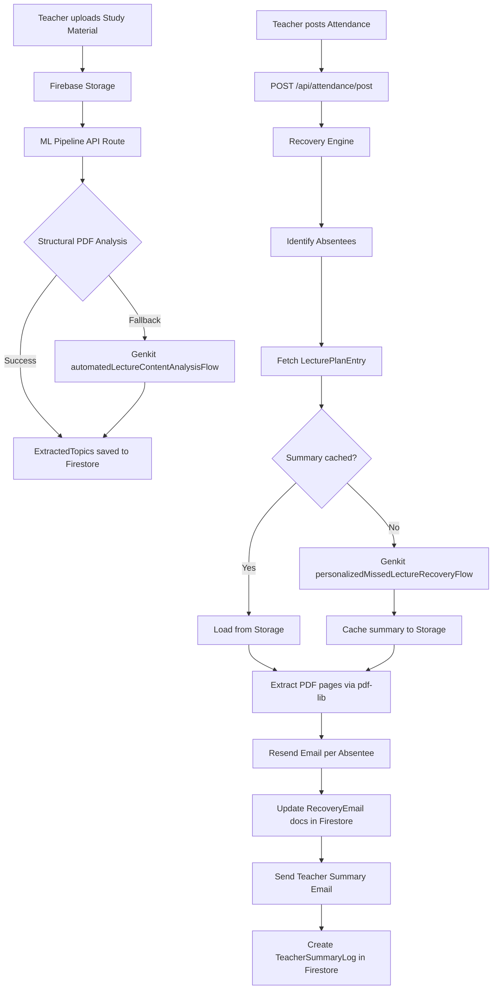
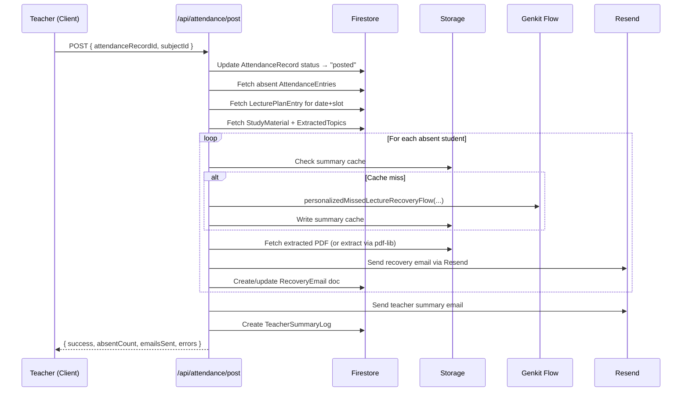

# Design Document: Missed Class Recovery Engine (MCRE)

## Overview

The Missed Class Recovery Engine (MCRE) is a server-orchestrated academic recovery platform layered on top of the existing Ascent Scholar Next.js 15 application. When a teacher posts attendance, the system automatically identifies absent students, generates personalized AI-powered recovery materials (lecture summaries + extracted PDF pages), and delivers them via email — all without manual intervention.

The system serves three roles:
- **Teacher** (Admin Portal at `/dashboard/*`) — manages subjects, materials, lecture plans, attendance, and views reports.
- **Student** — passive email recipient; no login required.
- **Developer** (Developer Portal at `/developer/*`) — monitors system health, manages ML pipeline, manages teacher accounts.

The design extends the existing Firebase stack (Auth, Firestore, Storage) and the two existing Genkit AI flows (`automatedLectureContentAnalysisFlow`, `personalizedMissedLectureRecoveryFlow`).

---

## Architecture

### High-Level Flow



### Route Architecture

```
src/app/
├── (auth)/
│   └── login/page.tsx              # Single login page for all roles
├── (admin)/
│   ├── layout.tsx                  # Admin layout with sidebar nav
│   ├── dashboard/page.tsx          # Stats cards + recent activity feed
│   └── subjects/
│       ├── page.tsx                # Subject grid
│       └── [subjectId]/
│           └── page.tsx            # Subject detail with 5 tabs
├── (developer)/
│   ├── layout.tsx                  # Developer layout
│   └── dashboard/page.tsx          # System health + logs + ML management
└── api/
    ├── attendance/
    │   └── post/route.ts           # Core orchestration endpoint
    ├── ml/
    │   ├── process/route.ts        # Trigger ML pipeline for a StudyMaterial
    │   └── reprocess/route.ts      # Developer-triggered reprocessing
    ├── subjects/route.ts           # Subject CRUD
    ├── students/
    │   ├── route.ts                # Student CRUD + bulk ops
    │   └── parse/route.ts          # File upload + parsing
    ├── lecture-plan/
    │   ├── route.ts                # LecturePlan CRUD
    │   └── parse/route.ts          # File upload + parsing
    ├── attendance/
    │   ├── route.ts                # Attendance CRUD
    │   └── parse/route.ts          # File upload + parsing
    ├── users/route.ts              # Developer: Teacher account management
    └── reports/
        └── csv/route.ts            # CSV export
```

### Middleware

`middleware.ts` at the project root handles:
1. Token verification via Firebase Admin SDK on all `/api/*` and protected page routes.
2. Role-based redirects: unauthenticated → `/login`; teacher on `/developer/*` → `/dashboard`; developer on `/dashboard/*` → `/developer`.

```mermaid
flowchart LR
    Request --> MW[middleware.ts]
    MW -->|No token| Login[/login]
    MW -->|Teacher + /developer/*| Dashboard[/dashboard]
    MW -->|Developer + /dashboard/*| Developer[/developer]
    MW -->|Valid| Next[Next.js Handler]
```

---

## Components and Interfaces

### Frontend Components

```
src/components/
├── admin/
│   ├── SubjectCard.tsx
│   ├── SubjectForm.tsx
│   ├── tabs/
│   │   ├── StudyMaterialTab.tsx
│   │   ├── LecturePlanTab.tsx
│   │   ├── StudentsTab.tsx
│   │   ├── AttendanceTab.tsx
│   │   └── ReportsTab.tsx
│   ├── attendance/
│   │   ├── AttendanceChecklist.tsx
│   │   └── PostAttendanceButton.tsx
│   ├── students/
│   │   ├── StudentTable.tsx        # @tanstack/react-table
│   │   └── StudentUploadForm.tsx
│   └── reports/
│       ├── AttendanceReportTable.tsx
│       └── StudentAbsenceSummary.tsx
└── developer/
    ├── SystemHealthCards.tsx
    ├── LogViewer.tsx
    └── MLPipelineManager.tsx
```

### API Route Interfaces

All API routes accept a Bearer token in the `Authorization` header. The middleware validates it before the route handler runs.

**POST /api/attendance/post**
```typescript
// Request body
{ attendanceRecordId: string; subjectId: string }

// Response
{ success: boolean; absentCount: number; emailsSent: number; errors: string[] }
```

**POST /api/ml/process**
```typescript
// Request body
{ studyMaterialId: string; subjectId: string }

// Response
{ success: boolean; topicsExtracted: number }
```

**POST /api/students/parse**
```typescript
// Request: multipart/form-data with file field
// Response
{ parsed: number; skipped: number; students: Student[] }
```

**POST /api/lecture-plan/parse**
```typescript
// Request: multipart/form-data with file field
// Response
{ parsed: number; skipped: number; entries: LecturePlanEntry[] }
```

**POST /api/attendance/parse**
```typescript
// Request: multipart/form-data with file field + subjectId
// Response
{ parsed: number; unmatched: string[]; entries: AttendanceEntry[] }
```

**GET /api/reports/csv?attendanceRecordId=&subjectId=**
```typescript
// Response: text/csv download
```

---

## Data Models

All Firestore documents use `createdAt` and `updatedAt` timestamps (Firestore `Timestamp`).

### User

```typescript
// /users/{uid}
interface User {
  uid: string;
  email: string;
  displayName: string;
  role: 'teacher' | 'developer';
  isActive: boolean;
  createdAt: Timestamp;
  updatedAt: Timestamp;
}
```

### Subject

```typescript
// /subjects/{subjectId}
interface Subject {
  subjectId: string;
  teacherId: string;           // Firebase Auth uid
  subjectName: string;
  subjectCode: string;
  classId: string;
  totalModules: number;
  createdAt: Timestamp;
  updatedAt: Timestamp;
}
```

### StudyMaterial

```typescript
// /subjects/{subjectId}/studyMaterials/{materialId}
interface StudyMaterial {
  materialId: string;
  subjectId: string;
  moduleNumber: number;
  fileName: string;
  storagePath: string;         // /subjects/{subjectId}/materials/{moduleNumber}/{fileName}
  mimeType: 'application/pdf' | 'application/vnd.openxmlformats-officedocument.presentationml.presentation';
  fileSizeBytes: number;
  processingStatus: 'pending' | 'processing' | 'processed' | 'failed';
  extractedTopics: ExtractedTopic[];
  teacherCorrectedTopics: ExtractedTopic[];  // preserved on reprocessing
  processingError?: string;
  createdAt: Timestamp;
  updatedAt: Timestamp;
}

interface ExtractedTopic {
  topicId: string;
  heading: string;
  subHeadings: string[];
  startPage: number;
  endPage: number;
  confidenceScore: number;     // [0.0, 1.0]
  isTeacherCorrected: boolean;
}
```

### LecturePlanEntry

```typescript
// /subjects/{subjectId}/lecturePlan/{entryId}
interface LecturePlanEntry {
  entryId: string;
  subjectId: string;
  date: string;                // ISO 8601: YYYY-MM-DD
  slot: string;                // e.g. "09:00-10:00"
  topicId: string;             // references ExtractedTopic.topicId
  topicHeading: string;        // denormalized for display
  createdAt: Timestamp;
  updatedAt: Timestamp;
}
```

### Student

```typescript
// /subjects/{subjectId}/students/{studentId}
interface Student {
  studentId: string;
  subjectId: string;
  name: string;
  registrationNumber: string;  // unique within a subject
  email: string;
  mobileNumber?: string;
  section?: string;
  hasValidEmail: boolean;      // computed: valid email format
  createdAt: Timestamp;
  updatedAt: Timestamp;
}
```

### AttendanceRecord

```typescript
// /subjects/{subjectId}/attendance/{recordId}
interface AttendanceRecord {
  recordId: string;
  subjectId: string;
  date: string;                // ISO 8601: YYYY-MM-DD
  slot: string;
  topicId?: string;            // from LecturePlanEntry if matched
  topicHeading?: string;
  status: 'draft' | 'posted';
  entries: AttendanceEntry[];
  postedAt?: Timestamp;
  createdAt: Timestamp;
  updatedAt: Timestamp;
}

interface AttendanceEntry {
  studentId: string;
  registrationNumber: string;
  name: string;
  status: 'present' | 'absent';
}
```

### RecoveryEmail

```typescript
// /subjects/{subjectId}/recoveryEmails/{emailId}
interface RecoveryEmail {
  emailId: string;
  subjectId: string;
  attendanceRecordId: string;
  studentId: string;
  studentName: string;
  studentEmail: string;
  registrationNumber: string;
  topicId: string;
  topicHeading: string;
  lectureDate: string;
  emailSubject: string;
  emailStatus: 'pending' | 'sent' | 'failed' | 'skipped';
  hasPdfAttachment: boolean;
  sentAt?: Timestamp;
  errorMessage?: string;
  createdAt: Timestamp;
  updatedAt: Timestamp;
}
```

### TeacherSummaryLog

```typescript
// /teacherSummaryLogs/{logId}
interface TeacherSummaryLog {
  logId: string;
  subjectId: string;
  attendanceRecordId: string;
  teacherId: string;
  teacherEmail: string;
  totalAbsent: number;
  emailsSent: number;
  emailsFailed: number;
  emailsSkipped: number;
  sentAt: Timestamp;
  createdAt: Timestamp;
}
```

### SystemLog

```typescript
// /systemLogs/{logId}
interface SystemLog {
  logId: string;
  type: 'email' | 'ml' | 'auth' | 'api';
  level: 'info' | 'warning' | 'error';
  message: string;
  context: Record<string, unknown>;  // subjectId, materialId, etc.
  createdAt: Timestamp;
}
```

---

## ML Pipeline Design

The ML pipeline runs server-side in `/api/ml/process` and follows a two-stage approach:

### Stage 1: Structural PDF Analysis

Uses `pdf-parse` to extract raw text with positional metadata. Applies heuristics to identify headings:
- Font size relative to body text (larger = heading)
- Bold text patterns
- Numbered section patterns (e.g., `1.`, `1.1`, `Chapter 1`)
- All-caps short lines

Each candidate heading gets a confidence score based on how many heuristics it matches.

### Stage 2: Genkit Fallback

If Stage 1 extracts fewer than 3 topics OR average confidence < 0.5, the pipeline falls back to `automatedLectureContentAnalysisFlow` with the PDF converted to a data URI. The Genkit flow returns structured module/section analysis which is mapped to `ExtractedTopic` objects with `confidenceScore: 0.7` (LLM-derived).

### Summary Caching

Before invoking `personalizedMissedLectureRecoveryFlow`, the Recovery Engine checks Storage for a cached summary at `/subjects/{subjectId}/summaries/{topicId}.txt`. If found, it skips the LLM call. After generation, the summary is written to that path.

### PDF Page Extraction

`pdf-lib` is used to extract pages `[startPage, endPage]` from the original StudyMaterial PDF and save the result to `/subjects/{subjectId}/extracted-pdfs/{topicId}.pdf`. This extracted PDF is attached to recovery emails.

---

## Core API: POST /api/attendance/post

This is the central orchestration endpoint. It runs entirely server-side using the Firebase Admin SDK.



The endpoint uses a batched Firestore write for all `RecoveryEmail` documents to minimize round-trips. For subjects with > 50 absent students, emails are dispatched in parallel batches of 10 using `Promise.allSettled` to prevent individual failures from blocking the batch.

---

## File Parsers

### Excel Parser (`src/lib/parsers/excel-parser.ts`)

Uses `xlsx` (SheetJS) to parse `.xlsx` and `.csv` files. Exports three typed functions:

```typescript
parseStudentRoster(buffer: Buffer): ParseResult<Student[]>
parseLecturePlan(buffer: Buffer): ParseResult<LecturePlanEntry[]>
parseAttendanceSheet(buffer: Buffer, roster: Student[]): ParseResult<AttendanceEntry[]>

interface ParseResult<T> {
  data: T;
  parsed: number;
  skipped: number;
  warnings: string[];
}
```

Column mapping is flexible — the parser normalizes common header variations (e.g., `"Reg No"`, `"Registration"`, `"Reg. Number"` all map to `registrationNumber`).

### PDF Parser (`src/lib/parsers/pdf-parser.ts`)

Uses `pdf-parse` to extract text from PDF tables. Applies line-by-line heuristics to detect tabular structure (consistent column spacing). Falls back to regex-based extraction for common attendance/roster formats.

### Pretty Printer (`src/lib/parsers/pretty-printer.ts`)

Serializes structured data back to Excel/CSV format for round-trip validation and CSV export:

```typescript
printStudentRoster(students: Student[]): Buffer      // xlsx
printLecturePlan(entries: LecturePlanEntry[]): Buffer // xlsx
printAttendanceSheet(entries: AttendanceEntry[]): Buffer // xlsx
printAttendanceCSV(data: CSVReportRow[]): string      // csv
```

---

## Email Pipeline

### Recovery Email Template

Built as a React Email component (or plain HTML string) containing:
- Student name greeting
- Lecture topic and date
- AI-generated summary (from `personalizedMissedLectureRecoveryFlow.lectureSummary`)
- Relevant page references table
- Attached extracted PDF (when available)

### Teacher Summary Template

Plain HTML email listing:
- Subject name, date, slot
- Total absent count
- Table: student name | registration number | email delivery status

### Resend Integration

```typescript
// src/lib/email/resend-client.ts
import { Resend } from 'resend';

const resend = new Resend(process.env.RESEND_API_KEY);

async function sendRecoveryEmail(params: RecoveryEmailParams): Promise<EmailResult>
async function sendTeacherSummary(params: TeacherSummaryParams): Promise<EmailResult>
```

---

## Developer Portal

The Developer Portal at `/(developer)/dashboard` provides:

1. **System Health Cards** — counts from Firestore: total users, subjects, emails sent, ML jobs, failed jobs (last 24h).
2. **Log Viewer** — paginated table of `/systemLogs` with filters for `type` and date range. Uses `@tanstack/react-table`.
3. **ML Pipeline Manager** — lists all `StudyMaterial` documents with `processingStatus: "failed"`, with a "Reprocess" button that calls `POST /api/ml/reprocess`.
4. **User Management** — table of `/users` with create/deactivate actions. Deactivation sets `isActive: false` in Firestore and calls Firebase Admin `auth.revokeRefreshTokens(uid)`.

---

## Correctness Properties

*A property is a characteristic or behavior that should hold true across all valid executions of a system — essentially, a formal statement about what the system should do. Properties serve as the bridge between human-readable specifications and machine-verifiable correctness guarantees.*

### Property 1: Role-based redirect correctness

*For any* authenticated user with a valid role (`"teacher"` or `"developer"`), the middleware redirect target should equal the role's designated portal (`/dashboard` for teacher, `/developer` for developer), and for any protected route accessed by the wrong role, the redirect should point to the correct role's portal.

**Validates: Requirements 1.2, 1.4, 1.5**

---

### Property 2: Protected route enforcement

*For any* path under `/dashboard/*` or `/developer/*`, a request without a valid Firebase ID token should be redirected to the login page, and a request with a valid token but wrong role should be redirected to the correct portal.

**Validates: Requirements 1.3, 1.4, 1.5**

---

### Property 3: Confidence score bounds

*For any* StudyMaterial processed by the ML pipeline, every `ExtractedTopic` in the result must have a `confidenceScore` in the range `[0.0, 1.0]` inclusive.

**Validates: Requirements 3.9**

---

### Property 4: Lecture plan parse round-trip

*For any* valid set of `LecturePlanEntry` records, serializing them to Excel/CSV format and then parsing the result must produce an equivalent set of `LecturePlanEntry` records (same date, slot, and topic for each entry).

**Validates: Requirements 4.3, 11.5**

---

### Property 5: Student roster parse round-trip

*For any* valid array of `Student` records, serializing them to Excel format and then parsing the result must produce an equivalent array of `Student` records with all fields preserved.

**Validates: Requirements 5.2, 11.5**

---

### Property 6: Attendance sheet parse round-trip

*For any* valid array of `AttendanceEntry` records, serializing them to Excel format and then parsing the result must produce an equivalent array of `AttendanceEntry` records with all student identifiers and statuses preserved.

**Validates: Requirements 6.4**

---

### Property 7: Student upsert on duplicate registration number

*For any* student upload where a registration number already exists in the subject's roster, after the upload completes there must be exactly one `Student` document with that registration number, containing the latest uploaded data.

**Validates: Requirements 5.4**

---

### Property 8: Invalid email students are skipped

*For any* `Student` record where `hasValidEmail` is `false` or the email field is empty, the Recovery Engine must not send a recovery email and must record `emailStatus: "skipped"` on the corresponding `RecoveryEmail` document.

**Validates: Requirements 5.7, 8.7**

---

### Property 9: Attendance draft state invariant

*For any* `AttendanceRecord` that has not had the POST action applied, its `status` field must be `"draft"` and no `RecoveryEmail` documents should exist for that record.

**Validates: Requirements 6.6**

---

### Property 10: Recovery email count equals absent student count

*For any* posted `AttendanceRecord` with N students marked `"absent"`, the Recovery Engine must create exactly N `RecoveryEmail` documents for that record (one per absent student, regardless of email validity).

**Validates: Requirements 7.1, 7.9**

---

### Property 11: Summary caching idempotence

*For any* topic that has already had a summary generated and cached, invoking the Recovery Engine again for the same topic must return the cached summary without invoking the Genkit LLM flow a second time.

**Validates: Requirements 7.7**

---

### Property 12: All RecoveryEmail documents reach a terminal status

*For any* completed Recovery Engine run, every `RecoveryEmail` document created during that run must have `emailStatus` in `{"sent", "failed", "skipped"}` — never `"pending"` — after the run completes.

**Validates: Requirements 7.11, 8.4, 8.5, 8.7**

---

### Property 13: Recovery email body contains required fields

*For any* recovery email generated by the system, the rendered email body must contain the student's name, the lecture topic, the lecture date, and the AI-generated summary.

**Validates: Requirements 8.2**

---

### Property 14: Log filter correctness

*For any* set of system logs and any filter criteria (type and/or date range), all logs returned by the log viewer query must satisfy the filter criteria, and no matching log must be omitted.

**Validates: Requirements 10.2**

---

### Property 15: CSV report completeness

*For any* `AttendanceRecord`, the generated CSV report must contain exactly one row per absent student, and each row must include all required columns: student name, registration number, email, topic missed, and email delivery status.

**Validates: Requirements 9.6, 9.7**

---

### Property 16: Server-side upload validation

*For any* file upload to any `/api/*/parse` route, the server must reject files with unsupported MIME types or sizes exceeding 50 MB, independent of any client-side validation.

**Validates: Requirements 3.7, 3.8, 12.4**

---

### Property 17: API route token enforcement

*For any* request to any `/api/*` route without a valid Firebase ID token, the middleware must return HTTP 401 without invoking the route handler.

**Validates: Requirements 12.5, 12.6**

---

### Property 18: Firestore subject ownership isolation

*For any* Teacher uid and any `Subject` document where `teacherId` does not equal that uid, Firestore security rules must deny read and write access to that document and all its sub-collections.

**Validates: Requirements 12.1**

---

## Error Handling

| Scenario | Behavior |
|---|---|
| ML pipeline fails to extract topics | Set `processingStatus: "failed"`, write `SystemLog` with `type: "ml"`, `level: "error"` |
| No LecturePlanEntry for posted date/slot | Write `SystemLog` warning, send generic notification email to absentees |
| StudyMaterial not processed when attendance posted | Send recovery email without PDF attachment, log warning |
| Resend API call fails for a student | Set `emailStatus: "failed"` on `RecoveryEmail`, write `SystemLog`, continue processing remaining students |
| Student has no valid email | Set `emailStatus: "skipped"` on `RecoveryEmail`, no email sent |
| File upload exceeds 50 MB | Return HTTP 400 with descriptive error before Storage write |
| Unsupported file MIME type | Return HTTP 400 with the unsupported type identified |
| Duplicate subject code + class ID | Return HTTP 409 validation error |
| Unauthenticated API request | Middleware returns HTTP 401 |
| Wrong-role page access | Middleware redirects to correct portal |
| Firebase Admin SDK error | Log to `SystemLog`, return HTTP 500 with generic message |

All errors are written to `/systemLogs/{logId}` with structured context (subjectId, materialId, studentId, etc.) for Developer Portal inspection.

---

## Testing Strategy

### Property-Based Testing

The project uses **fast-check** for property-based testing (TypeScript-native, no additional runtime dependencies beyond dev).

Each property test runs a minimum of **100 iterations**. Tests are tagged with a comment referencing the design property:

```typescript
// Feature: missed-class-recovery-engine, Property 4: Lecture plan parse round-trip
it.prop([fc.array(arbitraryLecturePlanEntry())])(
  'lecture plan parse round-trip',
  (entries) => { ... }
);
```

Properties targeted for PBT implementation:
- **Property 1 & 2**: Middleware redirect logic (pure function, no I/O)
- **Property 3**: ML pipeline confidence score bounds (mock pipeline output)
- **Properties 4, 5, 6**: Parser round-trips (pure serialization/deserialization)
- **Property 7**: Student upsert logic (in-memory roster simulation)
- **Property 8**: Email skip logic for invalid emails (pure function)
- **Property 9**: Attendance draft state invariant (state machine logic)
- **Property 10**: Recovery email count (mock Recovery Engine)
- **Property 11**: Summary caching idempotence (mock Storage + LLM)
- **Property 12**: Terminal email status (mock email dispatch)
- **Property 13**: Email body field presence (template rendering function)
- **Property 14**: Log filter correctness (pure filter function)
- **Property 15**: CSV report completeness (pure CSV generation function)
- **Property 16**: Server-side upload validation (pure validation function)
- **Property 17**: API token enforcement (middleware pure logic)
- **Property 18**: Firestore ownership isolation (Firestore emulator)

### Unit Tests

Example-based unit tests cover:
- Login form submission and error display
- Subject creation form validation
- Attendance checklist rendering
- Dashboard stats card rendering
- Developer portal health card rendering
- Manual student/lecture plan entry forms

### Integration Tests

Integration tests (using Firebase Emulator Suite) cover:
- Firestore security rules (Properties 12.1, 12.2, 12.3)
- Full attendance post → email dispatch flow with mocked Resend
- ML pipeline trigger on StudyMaterial creation
- Developer account deactivation preventing auth

### Test Configuration

```json
// jest.config.ts (or vitest.config.ts)
{
  "testEnvironment": "node",
  "setupFiles": ["./src/test/setup.ts"]
}
```

Fast-check configuration per property test:
```typescript
fc.configureGlobal({ numRuns: 100, verbose: true });
```
