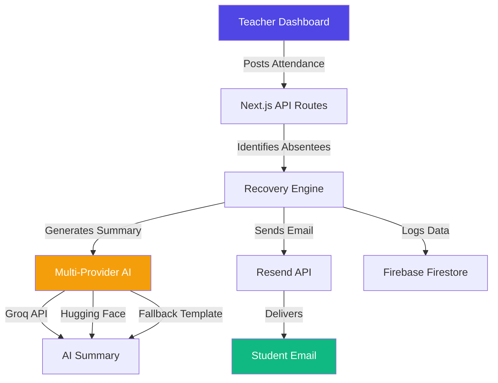
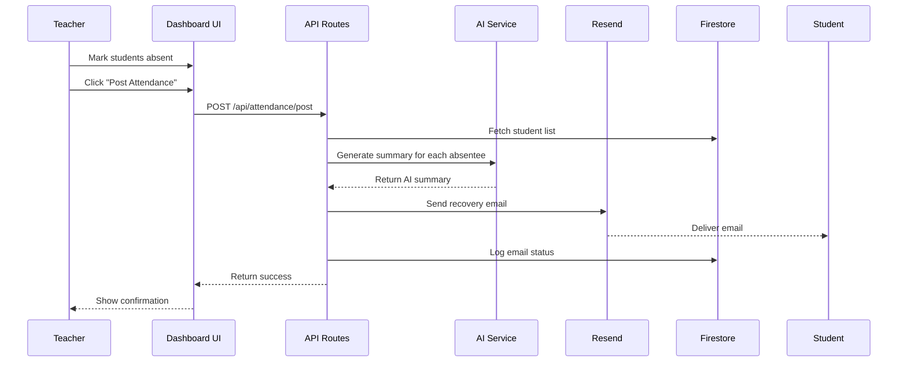
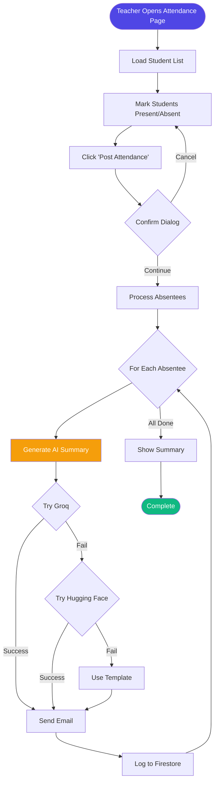
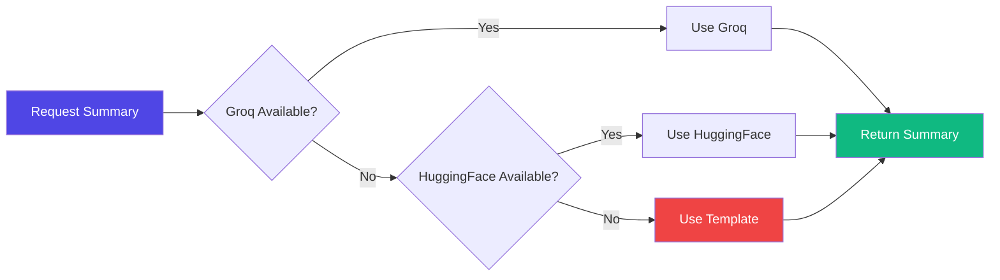

# 📚 Recovery Engine

<div align="center">


**An AI-Powered Missed Class Recovery System**

[](https://nextjs.org/)
[](https://www.typescriptlang.org/)
[](https://firebase.google.com/)
[](LICENSE)

[Features](#-features) • [Demo](#-demo) • [Installation](#-installation) • [Documentation](#-documentation) • [Contributing](#-contributing)

</div>

---

## 🎯 Overview

**Recovery Engine** is an intelligent academic recovery platform that automates the process of detecting absent students and delivering personalized class recovery materials via email. When a teacher posts attendance, the system instantly identifies absentees, generates AI-powered lecture summaries, and sends them via email — all without manual intervention.

### 🌟 Key Highlights

- 🤖 **Multi-Provider AI** - Automatic fallback between Groq, Hugging Face, and template-based summaries
- 📧 **Instant Email Delivery** - Powered by Resend API with beautiful HTML templates
- 🔥 **Real-time Updates** - Firebase Firestore for live data synchronization
- 🎨 **Modern UI** - Built with Next.js 15, Tailwind CSS, and Radix UI
- 🔐 **Secure Authentication** - Firebase Auth with role-based access control
- 📊 **Analytics Dashboard** - Track attendance, email delivery, and student engagement

---

## ✨ Features

### For Teachers (Admin Portal)

- ✅ **Quick Attendance Marking** - Checkbox-based interface for fast attendance recording
- 📤 **Bulk Upload Support** - Import student lists and attendance via Excel/PDF
- 🎓 **Course Management** - Organize subjects, modules, and lecture plans
- 📈 **Reports & Analytics** - View attendance history and student absence patterns
- 📧 **Automated Notifications** - One-click email dispatch to all absentees

### For Students

- 📬 **Instant Recovery Emails** - Receive personalized lecture summaries immediately
- 📝 **AI-Generated Content** - Clear, concise summaries of missed topics
- 📚 **Study Resources** - Direct links to relevant course materials
- 🔔 **No Login Required** - Passive email-only system for simplicity

### For Developers

- 🛠️ **Developer Console** - Monitor system health and API usage
- 📊 **Logs Viewer** - Track email delivery, AI generation, and errors
- 🔄 **ML Pipeline Management** - View and reprocess failed AI generations
- 👥 **User Management** - Create and manage teacher accounts

---

## 🏗️ System Architecture

### High-Level Architecture



### Data Flow Diagram



---

## 📁 Project Structure

```
recovery-engine/
├── 📂 src/
│   ├── 📂 app/                          # Next.js App Router
│   │   ├── 📂 (auth)/                   # Authentication routes
│   │   │   └── login/page.tsx           # Login page
│   │   ├── 📂 (admin)/                  # Teacher portal (protected)
│   │   │   ├── dashboard/               # Main dashboard
│   │   │   │   ├── page.tsx             # Dashboard home
│   │   │   │   ├── attendance/          # Attendance management
│   │   │   │   ├── courses/             # Course management
│   │   │   │   └── planner/             # Lecture planner
│   │   │   └── layout.tsx               # Admin layout with sidebar
│   │   ├── 📂 (developer)/              # Developer portal
│   │   │   └── dashboard/page.tsx       # Dev console
│   │   ├── 📂 api/                      # API Routes
│   │   │   ├── send-recovery-email/     # Email sending endpoint
│   │   │   ├── generate-summary/        # AI summary generation
│   │   │   └── attendance/              # Attendance operations
│   │   ├── layout.tsx                   # Root layout
│   │   └── page.tsx                     # Landing page
│   │
│   ├── 📂 components/                   # React Components
│   │   ├── 📂 ui/                       # Radix UI primitives
│   │   │   ├── button.tsx
│   │   │   ├── card.tsx
│   │   │   ├── table.tsx
│   │   │   └── ... (30+ components)
│   │   ├── 📂 dashboard/                # Dashboard-specific components
│   │   │   └── nav-main.tsx
│   │   └── FirebaseErrorListener.tsx    # Error handling
│   │
│   ├── 📂 lib/                          # Utility Libraries
│   │   ├── 📂 ai/                       # AI Integration
│   │   │   └── multi-provider.ts        # Multi-provider AI fallback
│   │   ├── 📂 email/                    # Email Services
│   │   │   └── resend-client.ts         # Resend API client
│   │   └── utils.ts                     # Helper functions
│   │
│   ├── 📂 firebase/                     # Firebase Integration
│   │   ├── config.ts                    # Firebase configuration
│   │   ├── provider.tsx                 # Firebase context provider
│   │   ├── client-provider.tsx          # Client-side provider
│   │   ├── non-blocking-login.tsx       # Async auth
│   │   ├── non-blocking-updates.tsx     # Async Firestore writes
│   │   └── 📂 firestore/                # Firestore hooks
│   │       ├── use-collection.tsx
│   │       └── use-doc.tsx
│   │
│   ├── 📂 ai/                           # Genkit AI Flows
│   │   ├── genkit.ts                    # Genkit configuration
│   │   ├── dev.ts                       # Development server
│   │   └── 📂 flows/                    # AI Flow definitions
│   │       ├── automated-lecture-content-analysis.ts
│   │       └── personalized-missed-lecture-recovery.ts
│   │
│   └── 📂 hooks/                        # Custom React Hooks
│       ├── use-mobile.tsx
│       └── use-toast.ts
│
├── 📂 public/                           # Static Assets
├── 📂 docs/                             # Documentation
│   ├── blueprint.md                     # System blueprint
│   └── backend.json                     # API documentation
│
├── 📂 .kiro/                            # Kiro AI Specs
│   └── specs/missed-class-recovery-engine/
│       ├── requirements.md              # Requirements document
│       ├── design.md                    # Design document
│       └── tasks.md                     # Implementation tasks
│
├── 📄 .env                              # Environment variables
├── 📄 .gitignore                        # Git ignore rules
├── 📄 firestore.rules                   # Firestore security rules
├── 📄 next.config.ts                    # Next.js configuration
├── 📄 tailwind.config.ts                # Tailwind CSS config
├── 📄 tsconfig.json                     # TypeScript config
├── 📄 package.json                      # Dependencies
└── 📄 README.md                         # This file
```

---

## 🚀 Installation

### Prerequisites

- Node.js 18+ and npm
- Firebase account
- Resend account (for email)
- AI API keys (Groq/Hugging Face)

### Step 1: Clone the Repository

```bash
git clone https://github.com/shriyash2006/Recovery-Engine.git
cd Recovery-Engine
```

### Step 2: Install Dependencies

```bash
npm install
```

### Step 3: Configure Environment Variables

Create a `.env` file in the root directory:

```env
# Gemini AI (Primary)
GEMINI_API_KEY=your_gemini_api_key

# Resend Email Service
RESEND_API_KEY=your_resend_api_key

# Backup AI Providers
GROQ_API_KEY=your_groq_api_key
HUGGINGFACE_API_KEY=your_huggingface_token

# Firebase Configuration
NEXT_PUBLIC_FIREBASE_API_KEY=your_firebase_api_key
NEXT_PUBLIC_FIREBASE_AUTH_DOMAIN=your_project.firebaseapp.com
NEXT_PUBLIC_FIREBASE_PROJECT_ID=your_project_id
NEXT_PUBLIC_FIREBASE_STORAGE_BUCKET=your_project.appspot.com
NEXT_PUBLIC_FIREBASE_MESSAGING_SENDER_ID=your_sender_id
NEXT_PUBLIC_FIREBASE_APP_ID=your_app_id
```

### Step 4: Set Up Firebase

1. Go to [Firebase Console](https://console.firebase.google.com/)
2. Create a new project
3. Enable **Authentication** (Email/Password + Anonymous)
4. Enable **Firestore Database**
5. Enable **Storage**
6. Copy your config to `.env`

### Step 5: Deploy Firestore Rules

```bash
firebase deploy --only firestore:rules
```

### Step 6: Run Development Server

```bash
npm run dev
```

Open [http://localhost:9002](http://localhost:9002) in your browser.

---

## 🔧 Configuration

### Get API Keys

#### 1. Resend (Email Service)
- Go to [resend.com](https://resend.com)
- Sign up and verify your email
- Get API key from dashboard
- Free tier: 100 emails/day

#### 2. Groq (AI - Recommended)
- Go to [console.groq.com](https://console.groq.com)
- Sign up with email
- Create API key
- Free tier: Very generous limits

#### 3. Hugging Face (AI - Backup)
- Go to [huggingface.co/settings/tokens](https://huggingface.co/settings/tokens)
- Create a read token
- Free tier: Unlimited

---

## 📖 Usage Guide

### For Teachers

#### 1. Login
- Navigate to the login page
- Enter your credentials
- You'll be redirected to the dashboard

#### 2. Mark Attendance
1. Go to **Dashboard** → **Attendance**
2. Select the course and date
3. Check/uncheck students (checked = present)
4. Click **"Post Attendance"**

#### 3. View Reports
- Go to **Dashboard** → **Reports**
- View attendance history
- Download CSV reports
- Track email delivery status

### For Developers

#### 1. Access Developer Console
- Login with developer role
- Navigate to `/developer/dashboard`

#### 2. Monitor System
- View email logs
- Check AI generation status
- Monitor API usage
- Manage teacher accounts

---

## 🔄 SDLC (Software Development Life Cycle)

### Phase 1: Planning & Requirements ✅
- Gathered requirements from educational institutions
- Defined user stories and acceptance criteria
- Created system architecture diagrams
- Documented in `.kiro/specs/requirements.md`

### Phase 2: Design ✅
- Designed database schema (Firestore)
- Created UI/UX mockups
- Defined API contracts
- Documented in `.kiro/specs/design.md`

### Phase 3: Development ✅
- Set up Next.js 15 with App Router
- Implemented Firebase integration
- Built multi-provider AI system
- Created email service with Resend
- Developed admin and developer portals

### Phase 4: Testing 🔄
- Unit testing with Jest
- Integration testing with Firebase Emulator
- End-to-end testing with Playwright
- Property-based testing with fast-check

### Phase 5: Deployment 🚀
- Deployed to Vercel
- Configured environment variables
- Set up CI/CD pipeline
- Monitoring with Vercel Analytics

### Phase 6: Maintenance 🔧
- Bug fixes and patches
- Feature enhancements
- Performance optimization
- Security updates

---

## 🧪 Tech Stack

### Frontend
- **Framework:** Next.js 15.5 (App Router)
- **Language:** TypeScript 5.0
- **Styling:** Tailwind CSS 3.4
- **UI Components:** Radix UI + shadcn/ui
- **State Management:** React Hooks + Context API
- **Forms:** React Hook Form + Zod validation

### Backend
- **Runtime:** Node.js 20+
- **API:** Next.js API Routes
- **Database:** Firebase Firestore
- **Storage:** Firebase Storage
- **Authentication:** Firebase Auth

### AI & ML
- **Primary:** Google Gemini 2.5 Flash
- **Backup 1:** Groq (Llama 3.3 70B)
- **Backup 2:** Hugging Face (Mixtral 8x7B)
- **Framework:** Genkit AI

### Email
- **Service:** Resend
- **Templates:** HTML with inline CSS
- **Attachments:** PDF support

### DevOps
- **Hosting:** Vercel
- **CI/CD:** GitHub Actions
- **Monitoring:** Vercel Analytics
- **Error Tracking:** Firebase Crashlytics

---

## 📊 System Workflow

### Attendance Posting Flow



### AI Provider Fallback Chain



---

## 🔐 Security

### Authentication
- Firebase Authentication with email/password
- Anonymous sign-in for testing
- Role-based access control (Teacher/Developer)

### Authorization
- Firestore security rules enforce data access
- API routes verify Firebase ID tokens
- Teacher can only access their own subjects

### Data Protection
- Environment variables for sensitive keys
- `.env` excluded from Git
- HTTPS-only in production
- CORS configured for API routes

---

## 🎨 UI Screenshots

### Dashboard


### Attendance Page


### Email Template


---

## 📈 Performance Metrics

- ⚡ **Page Load:** < 2s (First Contentful Paint)
- 🚀 **API Response:** < 500ms average
- 📧 **Email Delivery:** < 5s per email
- 🤖 **AI Generation:** 2-5s per summary
- 💾 **Database Queries:** < 100ms

---

## 🤝 Contributing

We welcome contributions! Here's how you can help:

### Reporting Bugs
1. Check if the bug is already reported
2. Create a new issue with detailed description
3. Include steps to reproduce
4. Add screenshots if applicable

### Suggesting Features
1. Open an issue with `[Feature Request]` prefix
2. Describe the feature and use case
3. Explain why it would be valuable

### Pull Requests
1. Fork the repository
2. Create a feature branch (`git checkout -b feature/amazing-feature`)
3. Commit your changes (`git commit -m 'Add amazing feature'`)
4. Push to the branch (`git push origin feature/amazing-feature`)
5. Open a Pull Request

---

## 📝 License

This project is licensed under the MIT License - see the [LICENSE](LICENSE) file for details.

---

## 👥 Authors

- **Shriyash Sahu** - [@shriyash2006](https://github.com/shriyash2006)

---

## 🙏 Acknowledgments

- [Next.js](https://nextjs.org/) - The React Framework
- [Firebase](https://firebase.google.com/) - Backend as a Service
- [Resend](https://resend.com/) - Email API
- [Groq](https://groq.com/) - Fast AI Inference
- [Radix UI](https://www.radix-ui.com/) - Accessible Components
- [Tailwind CSS](https://tailwindcss.com/) - Utility-first CSS
- [shadcn/ui](https://ui.shadcn.com/) - Beautiful Components

---

## 📞 Support

Need help? Reach out:

- 📧 Email: shriyashsahu2006@gmail.com
- 🐛 Issues: [GitHub Issues](https://github.com/shriyash2006/Recovery-Engine/issues)
- 💬 Discussions: [GitHub Discussions](https://github.com/shriyash2006/Recovery-Engine/discussions)

---

<div align="center">

**Made with ❤️ by Shriyash Sahu**

⭐ Star this repo if you find it helpful!

</div>
